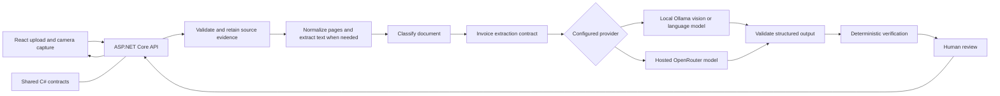

# Invoice OCR Architecture

## Purpose and status

Describe the target flow for turning invoice images or PDFs into reviewed, validated data. The repository has a React camera-capture client and an ASP.NET Core source-document intake endpoint, as well as a .NET console prototype. Camera intake is not yet connected to OCR, LLM extraction, durable evidence storage, or a review workflow. The current API intake uses in-memory idempotency state and test authentication; it is a prototype, not production processing.

## Components



The API owns file validation, orchestration, provider configuration, and response validation. Keep OCR and LLM access behind provider-independent interfaces so local inference (Ollama) and hosted inference (OpenRouter) can be compared or changed without changing the client contract. When local inference is selected, invoice content must not be sent to a hosted provider. Never expose provider credentials to the browser.

## Processing flow

1. The client uploads a PDF or image, or submits camera-captured pages.
2. The API validates the request and retains the original document and page order.
3. The processing flow checks page quality and normalizes pages; it uses embedded PDF text or OCR where appropriate.
4. The system classifies the document and routes supplier invoices to structured invoice extraction. Extraction may use text, source-page images, or both.
5. A configured provider adapter calls local Ollama or hosted OpenRouter and maps its response to the same invoice contract. Invalid or incomplete output is treated as untrusted and reported, not silently accepted.
6. Deterministic rules verify fields and amounts where applicable. The result and its provenance are retained for review.
7. The client presents candidate values, warnings, and source references for human correction. Corrections and processing events are auditable.

Provider choice is configuration on the server, not a browser credential or provider-specific client contract. Compare providers using the same evaluation documents, input path, extraction contract, and relevant prompt/schema versions. Start evaluation-data preparation alongside provider implementation; complete comparative evaluation before enabling automated routing.

## Current prototype and validation path

The web client currently captures one to three JPEG pages and submits them to `POST /api/source-documents`. The API validates the intake payload and returns a source-document ID, but it does not yet persist the images durably or invoke OCR/LLM extraction. OpenRouter configuration is loaded by the API at startup, but camera intake does not call the extraction provider.

A separate evidence-storage layer retains confirmed invoice, purchase-order, and receipt artifacts with source references, review status, provenance, and audit events. This persistence layer is additive to intake and references the original source-document IDs instead of redefining the intake contracts.

The console prototype sends a PDF directly to OpenRouter using `google/gemini-2.5-flash` and returns transcribed text. Ollama is not integrated into the console or camera workflow; current Ollama instructions describe a separate manual experiment. There is no provider switch or automated, like-for-like evaluation yet. See the [feature brief index](../planning/feature-briefs/feature-brief-index.md) for the implementation sequence and [Feature 06](../planning/feature-briefs/feature-06-ap-line-item-conversion.md) and [Feature 20](../planning/feature-briefs/feature-20-model-quality-evaluation.md) for extraction and evaluation requirements.

## Example response

```json
{
  "vendorName": "ABC Supplies",
  "invoiceNumber": "INV-1042",
  "invoiceDate": "2026-10-01",
  "dueDate": "2026-10-15",
  "subtotal": 1250.00,
  "tax": 125.00,
  "total": 1375.00,
  "currency": "SGD",
  "extractionProvider": "ollama",
  "extractionModel": "configured-vision-model",
  "lineItems": [
    {
      "description": "Office chairs",
      "quantity": 4,
      "unitPrice": 250.00,
      "amount": 1000.00
    }
  ],
  "rawText": "OCR extracted text",
  "warnings": []
}
```

The example is illustrative; model-reported confidence is not ground truth. Candidate values should retain page or text provenance, and missing or uncertain values should be surfaced for review.

## Implementation sequence

1. Complete the shared intake and durable source-evidence path.
2. Add page-quality checks, normalization, and raw-text extraction.
3. Classify documents and agree on the invoice output contract.
4. Add provider-independent structured extraction, with local Ollama and hosted OpenRouter options.
5. Prepare an evaluation set alongside extraction work; compare providers using equivalent inputs and record quality, latency, and hosted usage cost where available.
6. Add deterministic verification and human review with provenance and audit history.
7. Complete access control and processing reliability before shared or production use; add matching and automation only after their evidence, reference-data, and evaluation dependencies are met.

