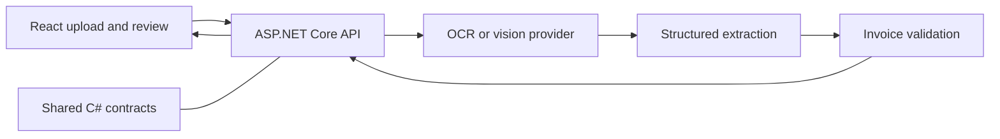

# Invoice OCR Architecture

## Purpose and status

Describe the proposed flow for turning invoice images or PDFs into validated data. The current repository has a .NET console prototype, ASP.NET Core server scaffolding, and shared-project scaffolding. The React client and end-to-end API flow are future work.

## Components



The API owns file validation, orchestration, provider credentials, and response validation. Keep OCR and LLM access behind provider-independent interfaces so local tools (such as Tesseract and Ollama) and cloud services (such as Gemini or OpenRouter) can be compared or changed without changing the client contract. Never expose provider keys to the browser.

## Processing flow

1. Client uploads an invoice to the API.
2. API validates file type and size and optionally preprocesses the document.
3. OCR or a vision model extracts text and candidate fields.
4. Extraction output is validated against the shared invoice contract.
5. API returns the result, including warnings for uncertain or missing values.
6. Client presents the result for user review and correction.

Start with local validation where practical, then compare cloud providers. Prefer a vision-first pipeline for a simple prototype; use OCR followed by text extraction when cost control, traceability, or OCR tuning matters.

## Current prototype and validation path

The console prototype currently sends a PDF directly to OpenRouter using `google/gemini-2.5-flash` and returns transcribed text. Its API key is read from the path in `ILP.Console`'s `App.config`. The local GGUF method is not called by the current entry point, and Ollama is not integrated with the console.

For now, test Ollama separately with invoice text, then run the sample PDF through the console and OpenRouter. These are manual experiments, not a provider switch or automated, like-for-like comparison. A fair comparison requires both providers to receive equivalent input and use the same prompt and output contract. Provider abstraction and structured invoice extraction remain future work.

## Example response

```json
{
  "vendorName": "ABC Supplies",
  "invoiceNumber": "INV-1042",
  "invoiceDate": "2026-10-01",
  "dueDate": "2026-10-15",
  "subtotal": 1250.00,
  "tax": 125.00,
  "total": 1375.00,
  "currency": "SGD",
  "lineItems": [
    {
      "description": "Office chairs",
      "quantity": 4,
      "unitPrice": 250.00,
      "amount": 1000.00
    }
  ],
  "rawText": "OCR extracted text",
  "confidence": 0.94,
  "warnings": []
}
```

## Implementation order

1. Agree on the invoice contract and API behavior.
2. Validate extraction locally with sample invoices.
3. Add the API processing endpoint and provider abstraction.
4. Build the upload and review client.
5. Improve validation, error handling, and export.

