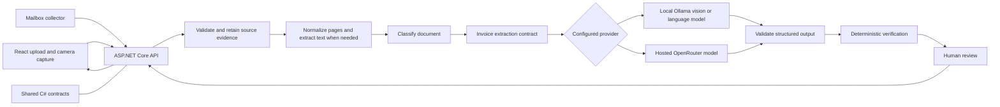

# Invoice OCR Architecture

## Purpose and status

Describe the target flow for turning invoice images or PDFs into reviewed, validated data. The repository has a React camera-capture client, an ASP.NET Core source-document intake endpoint, an evidence-storage API, a mailbox collector prototype, and a .NET console prototype. Camera intake is not yet connected to OCR, LLM extraction, evidence storage, or a review workflow. Intake stores originals and source-document records on local disk (see [Storage decision](#storage-decision)), and sign-in is a development-only test scheme (the API does not start outside Development until Feature 17); this is a prototype, not production processing.

## Components



The API owns file validation, orchestration, provider configuration, and response validation. Keep OCR and LLM access behind provider-independent interfaces so local inference (Ollama) and hosted inference (OpenRouter) can be compared or changed without changing the client contract. When local inference is selected, invoice content must not be sent to a hosted provider. Never expose provider credentials to the browser.

## Processing flow

1. The client uploads a PDF or image or submits camera-captured pages, or the mailbox collector submits an email attachment. All three use the [shared source-document intake contract](../../specs/001-camera-capture/contracts/source-document-intake.md) and differ only in `channel` and `origin`.
2. The API validates the request and retains the original document and page order.
3. The processing flow checks page quality and normalizes pages; it uses embedded PDF text or OCR where appropriate.
4. The system classifies the document and routes supplier invoices to structured invoice extraction. Extraction may use text, source-page images, or both.
5. A configured provider adapter calls local Ollama or hosted OpenRouter and maps its response to the same invoice contract. Invalid or incomplete output is treated as untrusted and reported, not silently accepted.
6. Deterministic rules verify fields and amounts where applicable. The result and its provenance are retained for review.
7. The client presents candidate values, warnings, and source references for human correction. Corrections and processing events are auditable.

Provider choice is configuration on the server, not a browser credential or provider-specific client contract. Compare providers using the same evaluation documents, input path, extraction contract, and relevant prompt/schema versions. Start evaluation-data preparation alongside provider implementation; complete comparative evaluation before enabling automated routing.

## Current prototype and validation path

The web client currently captures one to three JPEG pages and submits them to `POST /api/source-documents` with `channel` = `camera-capture`. The API validates the intake payload, stores the original pages in the protected document content store, and returns a source-document ID and `storageLocation`; it does not yet invoke OCR/LLM extraction. OpenRouter configuration is loaded by the API at startup, but camera intake does not call the extraction provider. The mailbox collector prototype (`src/server/ILP.Collector`) still sends attachments straight to extraction instead of through intake; Feature 03 moves it onto the shared intake path.

A separate evidence-storage layer retains confirmed invoice, purchase-order, and receipt artifacts with source references, review status, provenance, and audit events. This persistence layer is additive to intake and references the original source-document IDs instead of redefining the intake contracts.

The console prototype sends a PDF directly to OpenRouter using `google/gemini-2.5-flash` and returns transcribed text. Ollama is not integrated into the console or camera workflow; current Ollama instructions describe a separate manual experiment. There is no provider switch or automated, like-for-like evaluation yet. See the [feature brief index](../planning/feature-briefs/feature-brief-index.md) for the implementation sequence and [Feature 06](../planning/feature-briefs/feature-06-ap-line-item-conversion.md) and [Feature 20](../planning/feature-briefs/feature-20-model-quality-evaluation.md) for extraction and evaluation requirements.

## Evidence storage boundary

The evidence package API (`/api/evidence-packages`, see [the contract](../../specs/002-document-evidence-storage/contracts/document-evidence-storage.md)) is persistence, retrieval, provenance, and audit only. It does not ingest, extract, classify, match, or approve. The [data model overview](../../specs/002-document-evidence-storage/data-model.md#overview) has a terminology table, an entity diagram, and the package lifecycle.

| Concern | Owner |
|---|---|
| Capturing or importing source files | Intake (`/api/source-documents`, mailbox collector) |
| Producing candidate values | Extraction and classification features |
| Deciding a match or discrepancy | Three-way matching features |
| Retaining documents, records, provenance, review status, audit, and the link to a match decision | Evidence storage |

- Packages reference intake documents through `sourceDocumentId`; intake contracts are unchanged.
- New evidence is `draft` or `pending-review`; only `POST /{id}/finalize` produces `confirmed` evidence. Final evidence is deduplicated by source reference and case, and changes after finalization require an explicit replacement that supersedes the prior version.
- Corrections, verification results, and status changes append provenance entries and audit events; earlier values are never overwritten.
- Failed saves are recorded as `failed` (create) or leave the prior state (later operations); no success response is returned.
- Finalized evidence is retained for the 3-year pilot default before archive, after which content and values are withheld on retrieval. Production retention must be confirmed before go-live; deletion is not automated.
- Storage is a file-backed JSON store under `EvidenceStorage:RootPath` for the pilot. Duplicate checks are serialized within a single API instance; scaling out requires a store-level uniqueness constraint.

## Storage decision

Original files (images and PDFs) are stored in MySQL, in the same database that will hold the metadata, so the file and its record live in one backed-up system. Each stored part is one `LONGBLOB` row in `source_document_content` (`source_document_id`, server-generated `file_name`, `content_type`, `size_bytes`, `content`), written in one transaction so a source document is stored completely or not at all. The table is created on first use.

| Data | Pilot (now) | Target |
|---|---|---|
| Original files and derived page images (all channels) | MySQL `source_document_content` behind `IDocumentContentStore` (`EvidenceStorage:ContentProvider` = `MySql`, connection string `IlpDatabase`); a local folder (`File`, `EvidenceStorage:ContentRootPath`) remains as a fallback when MySQL is unavailable | Same; move to object storage behind the same interface only if volume makes the database too large to back up or restore comfortably |
| Intake source-document records and idempotency keys | JSON files (`EvidenceStorage:SourceDocumentRecordsPath`) | MySQL |
| Evidence packages, records, provenance, audit | JSON files (`EvidenceStorage:RootPath`) | MySQL, with the schema agreed with Feature 06 (`DocumentDto`) |

Uploads are limited by the API request-size limit (about 30 MB), below MySQL 8's default 64 MB `max_allowed_packet`. Files are read whole into memory when served, which is acceptable for invoice-sized documents. Metadata moves to MySQL when the review queue and multiple reviewers arrive (Feature 07). Files are served only through authorized API endpoints (`GET /api/source-documents/{id}/pages/{n}` for image pages and `/file` for an uploaded original), never through public links. Encryption at rest, deletion after retention, and database credentials from a secret store are required before production.

## Example response

```json
{
  "vendorName": "ABC Supplies",
  "invoiceNumber": "INV-1042",
  "invoiceDate": "2026-10-01",
  "dueDate": "2026-10-15",
  "subtotal": 1250.00,
  "tax": 125.00,
  "total": 1375.00,
  "currency": "SGD",
  "extractionProvider": "ollama",
  "extractionModel": "configured-vision-model",
  "lineItems": [
    {
      "description": "Office chairs",
      "quantity": 4,
      "unitPrice": 250.00,
      "amount": 1000.00
    }
  ],
  "rawText": "OCR extracted text",
  "warnings": []
}
```

The example is illustrative; model-reported confidence is not ground truth. Candidate values should retain page or text provenance, and missing or uncertain values should be surfaced for review.

## Implementation sequence

1. Complete the shared intake and durable source-evidence path.
2. Add page-quality checks, normalization, and raw-text extraction.
3. Classify documents and agree on the invoice output contract.
4. Add provider-independent structured extraction, with local Ollama and hosted OpenRouter options.
5. Prepare an evaluation set alongside extraction work; compare providers using equivalent inputs and record quality, latency, and hosted usage cost where available.
6. Add deterministic verification and human review with provenance and audit history.
7. Complete access control and processing reliability before shared or production use; add matching and automation only after their evidence, reference-data, and evaluation dependencies are met.

