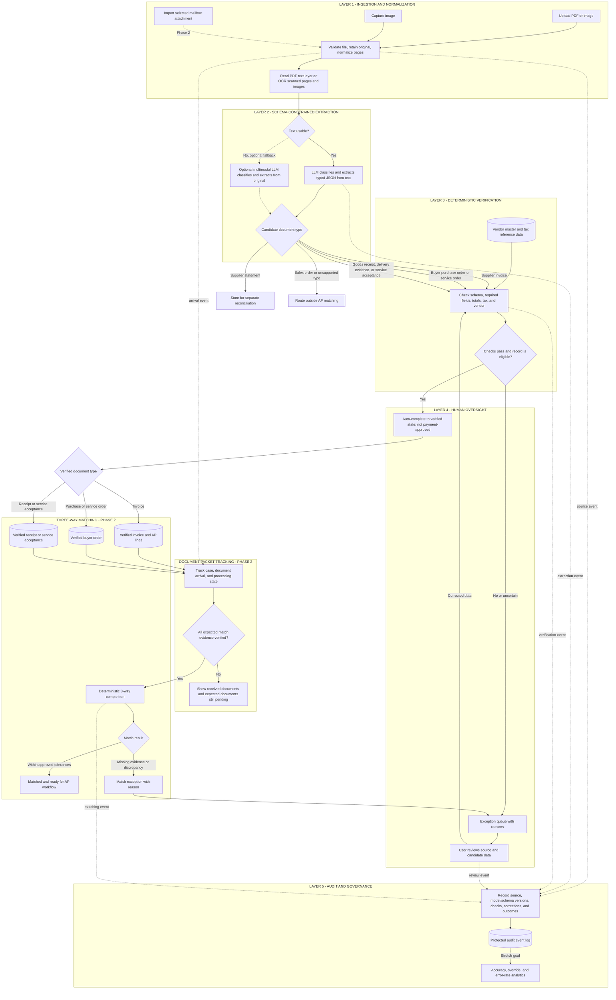

# AP Invoice Processing: Five Layers

The MVP turns an uploaded or captured document into a reviewed, auditable invoice record. Mailbox collection and three-way matching build on that foundation. Only a supplier invoice creates AP invoice lines. Orders and receipt/service-acceptance documents provide matching evidence.

For PDFs, read an existing text layer when usable and OCR only scanned pages; preprocess camera images before OCR. The normal extraction path classifies the document and asks a schema-constrained LLM for candidate JSON. An optional multimodal model can be evaluated when OCR text is unusable. Both paths use the same application contract and must pass deterministic validation. Confidence alone never authorizes a financial decision.

The MVP requires manual review for uncertain or failed checks and an audit trail for source references, model/schema versions, verification outcomes, and corrections. Straight-through processing is a later phase: a clean record may become ready for the AP workflow, but is never thereby approved for payment. Audit analytics are a stretch goal; capture their underlying events from the start.

Three-way matching compares a buyer's purchase order (or service order), supplier invoice, and evidence that goods were received or services accepted. Supplier delivery orders may support receipt verification, but buyer goods-receipt records are stronger evidence. Supplier statements belong to separate reconciliation; seller sales orders are not buyer purchase orders.

Packet tracking begins when the first document arrives and links later documents to the same case. Mark a document pending only when an order or configured business rule establishes that it is expected; do not infer missing documents from inbox silence alone.