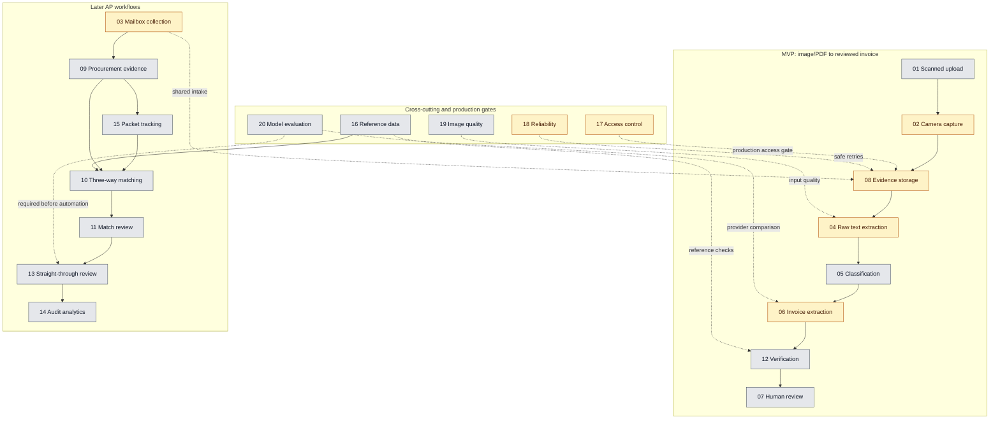

# Feature Briefs for Spec Kit

These files are concise inputs, not completed specifications. Feed one brief at a time to `/speckit-specify`. Priority is recorded here rather than in filenames so the files remain stable as the roadmap changes.

## Feature Workflow

1. Choose the next brief from the priority and dependency lists below.
2. In Copilot Chat at the repository root, run `/speckit-specify` and tell it to read the selected brief as the feature description. For example: `/speckit-specify Read docs/planning/feature-briefs/feature-02-camera-capture.md and use it as the feature requirements. Preserve its scope and flag unresolved product decisions; do not implement the feature.`
3. Review the generated `specs/NNN-feature-name/spec.md` and its `checklists/requirements.md`. The specification should describe user needs and acceptance outcomes, not prescribe implementation details.
4. Resolve any important open questions with `/speckit-clarify`, then continue with `/speckit-plan`, `/speckit-tasks`, `/speckit-analyze`, and `/speckit-implement`. Use `/speckit-converge` to check for remaining work.

Specify creates one feature per invocation and updates `.specify/feature.json` to point to the active feature. Complete or pause that feature's workflow before running `/speckit-specify` for another brief, so downstream commands continue to target the intended spec.

See [the five-layer AP processing flow](../ap-three-way-matching-flow.md). Only supplier invoices create AP invoice lines. Orders describe what was authorized; receipt or service-acceptance documents describe what was received. Basic audit events are required from the first release; analytics dashboards can follow.

## Status Legend

Status is based on current code, not task checkboxes: **Done** means end-to-end, **Partially covered** means prototype/scaffolding, and **Not started** means no workflow found. No brief is done end-to-end.

## Status Map

Green = done; amber = partially covered; gray = not started. Solid arrows show the primary sequence; dotted arrows show cross-cutting dependencies.

## Feature Status

**MVP, in order:** [01 Scanned upload](feature-01-scanned-document-upload.md) - Not started; [02 Camera capture](feature-02-camera-capture.md) - Partially covered; [08 Evidence storage](feature-08-document-evidence-storage.md) - Partially covered; [04 Raw text](feature-04-raw-text-extraction.md) - Partially covered; [05 Classification](feature-05-document-classification.md) - Not started; [06 Invoice extraction](feature-06-ap-line-item-conversion.md) - Partially covered; [12 Verification](feature-12-deterministic-verification.md) - Not started; [07 Human review](feature-07-extraction-review-dashboard.md) - Not started.

**Cross-cutting:** [17 Access control](feature-17-access-control-and-review-authorization.md) - Partially covered; [18 Reliability](feature-18-processing-reliability-and-deduplication.md) - Partially covered; [19 Image quality](feature-19-document-quality-feedback.md) - Not started; [16 Reference data](feature-16-reference-data-and-rules.md) - Not started; [20 Model evaluation](feature-20-model-quality-evaluation.md) - Not started.

**Later AP workflows:** [03 Mailbox collection](feature-03-mailbox-collection.md) - Partially covered; [09 Procurement evidence](feature-09-procurement-evidence-extraction.md) - Not started; [15 Packet tracking](feature-15-document-packet-tracking.md) - Not started; [10 Three-way matching](feature-10-three-way-matching.md) - Not started; [11 Match review](feature-11-three-way-match-review.md) - Not started; [13 Straight-through review](feature-13-straight-through-review-orchestration.md) - Not started; [14 Audit analytics](feature-14-audit-analytics.md) - Not started.

Start a small Feature 20 comparison alongside Feature 06; complete full evaluation before Feature 13. Features 17 and 18 gate production use. Feature 16 is needed for reference-based checks; three-way matching also depends on Feature 09. A match is not payment approval.

## Owned Terms

Each business term has one owning feature and one meaning (constitution Principle IX). Other features refer to it by its identifier.

| Term | Meaning | Owner | Code / API |
|---|---|---|---|
| Source document | A file received by intake. Camera, upload, and mailbox all create the same record; only `channel` and `origin` differ. | 01-03 Intake | `SourceDocumentMetadata`, `/api/source-documents`, `sourceDocumentId`, `channel`, `origin` |
| Source reference | The business reference printed on a document (invoice, order, or receipt number). | 08 Evidence storage | `sourceReference` |
| Document type | What a document is: supplier invoice, purchase order, goods receipt, and so on. | 05 Classification | `documentType` (evidence storage uses a coarser list until aligned) |
| Evidence | Documents and values that support a match or approval decision. | 08 Evidence storage | `ILP.Shared.Evidence` |
| Evidence package | One versioned set of evidence documents and records for a case; a case can have several. | 08 Evidence storage | `EvidencePackage`, `/api/evidence-packages` |
| Evidence document | An original invoice, order, or receipt kept in an evidence package. | 08 Evidence storage | `EvidenceDocument`, `documentId` |
| Structured record | One value read from a document, such as an invoice line amount. | 08 Evidence storage | `StructuredRecord`, `recordId` |
| Provenance | Where a value came from and every change since. | 08 Evidence storage | `ProvenanceEntry` |
| Case, packet | The AP case and the set of documents expected and received for it. | 15 Packet tracking | `caseId` |
| Match result, match review | The outcome of a three-way match and its review. | 10-11 Matching | `matchReviewId` (evidence storage links it through `MatchOutcome`) |
