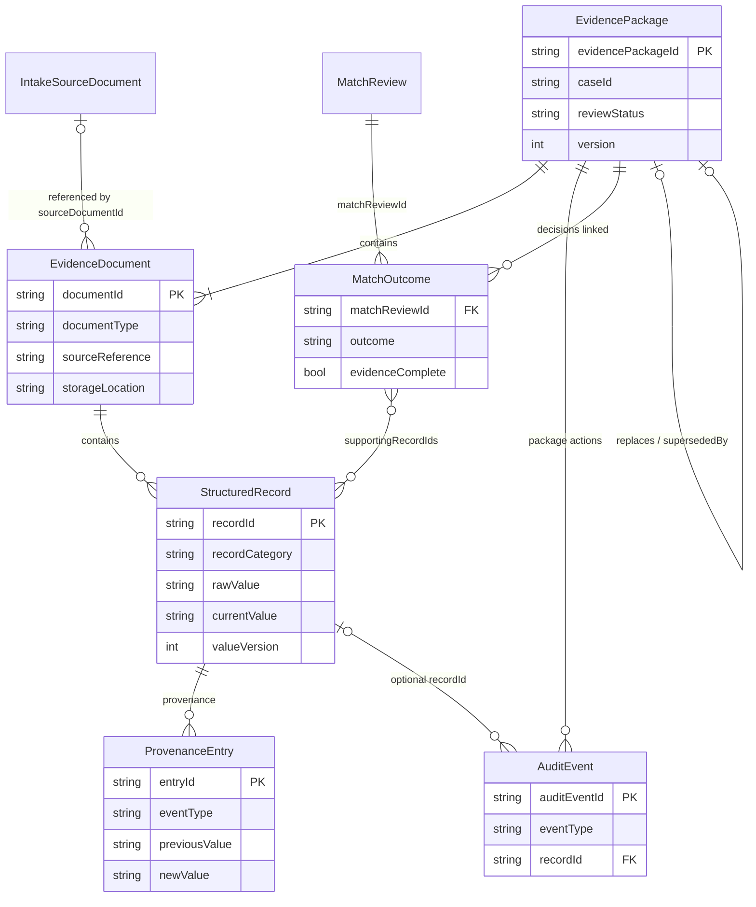
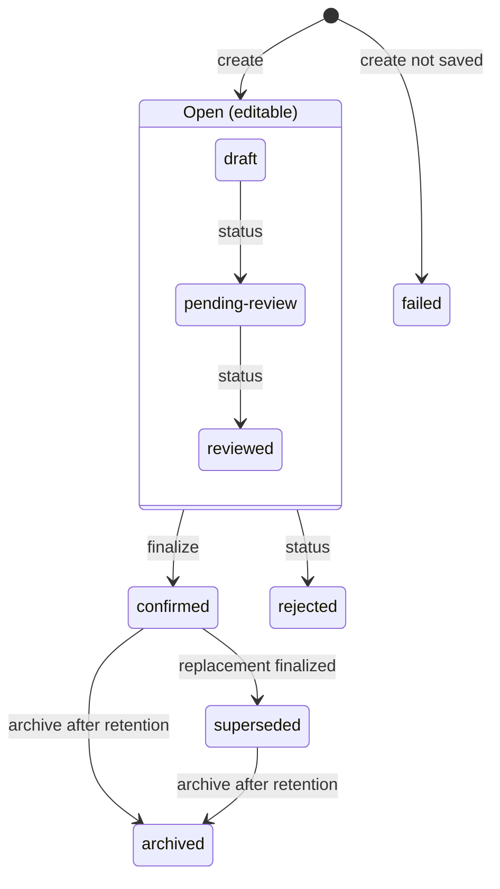

# Data Model: Document Evidence Storage

The data model below supports the durable retention, retrieval, provenance, draft/final lifecycle, and auditability requirements for AP evidence packages. Code: [EvidenceModels.cs](../../src/shared/ILP.Shared/Evidence/EvidenceModels.cs) and [EvidenceEnums.cs](../../src/shared/ILP.Shared/Evidence/EvidenceEnums.cs).

## Overview

### Terminology

| Term | Plain meaning | Type / JSON |
|---|---|---|
| Evidence package | One versioned set of documents and their records submitted for a case. A case can have several (drafts, later arrivals, replacements). | `EvidencePackage` |
| Case | The AP business case the package belongs to (`caseId`). Case and packet tracking are owned by Feature 15. | `caseId` |
| Evidence document | One original invoice, purchase order, or receipt file kept in a package, by reference to protected storage. | `EvidenceDocument` / `documentId` |
| Intake source document | The upload received by `/api/source-documents` (camera, scan, mailbox). Evidence links to it; it is not replaced. | `sourceDocumentId` |
| Structured record | One value read from a document, such as an invoice line amount or a received quantity. | `StructuredRecord` |
| Provenance | Where a value came from and every change since (FR-003). Each step (extracted, corrected, verified, finalized, and so on) is one provenance entry. | `ProvenanceEntry` / `provenance` |
| Audit event | One action on the package: source attached, finalized, match recorded, archived, and so on. | `AuditEvent` |
| Actor type | Who acted: `model` produced a value; `user` entered or corrected a value; `reviewer` made a review decision (status change, finalize, replacement); `system` acted automatically (verification, match link, archive, failed save). | `actorType` |
| Review status | The overall lifecycle state of a package, document, or record, including end states such as `superseded`, `archived`, and `failed`. | `reviewStatus` |
| Match outcome | A link to a decision made by three-way matching (Features 10/11) and the records it relied on. | `MatchOutcome` |
| Finalize | The explicit step that turns open evidence into `confirmed` evidence. | `POST /{id}/finalize` |
| Replacement | A new package version that supersedes confirmed evidence; the only way to change final evidence. | `replacesEvidencePackageId` |
| Retention / archive | Confirmed evidence is kept 3 years (pilot), then may be archived with content withheld. | `retentionUntil`, `archived` |

### How the entities connect

`IntakeSourceDocument` (Features 01-03) and `MatchReview` (Features 10/11) are owned by other features; evidence storage only holds their IDs. Document types map to record categories: `invoice` to `invoice-line`, `purchase-order` to `purchase-order-commitment`, `receipt` to `goods-receipt` or `service-acceptance`; `other-evidence` may hold any category.

### Package lifecycle

While open, `POST /{id}/status` can move between `draft`, `pending-review`, and `reviewed` in any order, and corrections are allowed. `rejected` and `failed` are end states. Confirmed evidence is never edited: it can only gain verification results and match outcomes, be superseded by a replacement, or be archived. Documents and records follow the package on finalize, supersede, and archive; individual records can be set to `rejected` while open and are then left out of finalization. Match outcomes can be linked while the package is `pending-review`, `reviewed`, or `confirmed`.

## EvidencePackage

One versioned set of documents and records submitted for a case. A case can have several packages: drafts, documents that arrive later, and replacements.

| Field | Type | Rules |
|---|---|---|
| `evidencePackageId` | UUID | Stable package identifier. |
| `caseId` | string | Business case identifier the package belongs to. Supplied by the caller until Feature 15 assigns case IDs. |
| `packageType` | enum | Read-only; derived by the server from the document types: `invoice`, `purchase-order`, or `receipt` when all documents share that type, otherwise `mixed`. |
| `reviewStatus` | enum | `draft`, `pending-review`, `reviewed`, `confirmed`, `rejected`, `superseded`, `archived`, `failed` (save not committed). |
| `createdAt` | timestamp | Creation time of the package. |
| `updatedAt` | timestamp | Last modification time. |
| `retentionPolicy` | enum/string | Default `pilot-3-year`; can be extended by production policy review. |
| `relatedMatchReviewId` | string? | Optional link to a three-way match or review decision that used this package. |
| `version` | integer | Starts at 1; a replacement package is the replaced version + 1. |
| `replacesEvidencePackageId` / `supersededByEvidencePackageId` | UUID? | Explicit replacement chain. |
| `replacementReason` | string? | Required when `replacesEvidencePackageId` is set. |
| `finalizedAt` / `retentionUntil` / `archivedAt` | timestamp? | Set on finalization (retention = finalizedAt + 3 years) and archive. |
| `matchOutcomes` | list | See [MatchOutcome](#matchoutcome). |
| `contentRestricted` | boolean | `true` on retrieval of archived packages; storage locations and values are withheld. |

### Package rules

- A package groups one or more evidence documents and related structured records for the same case.
- Final packages are deduplicated by source + case unless an explicit replacement or reprocessing workflow creates a new version.
- Draft packages must remain separate and are not treated as approved evidence until finalized.

## EvidenceDocument

The original invoice, purchase order, receipt, or associated source artifact retained as the authoritative source for a case.

| Field | Type | Rules |
|---|---|---|
| `documentId` | UUID | Stable document identifier. |
| `evidencePackageId` | UUID | Parent package identifier. |
| `sourceDocumentId` | string? | Optional reference to the intake-level source document ID. |
| `documentType` | enum | `invoice`, `purchase-order`, `receipt`, `other-evidence`. |
| `sourceReference` | string | Business reference printed on the document (invoice, purchase-order, or receipt number); with `caseId` it drives duplicate detection. Channel identifiers such as an email message ID stay in the intake source document's `origin`. |
| `storageLocation` | string | Protected storage path or object identifier for the original file. Required on create; withheld (`null`) when archived. |
| `checksum` | string | Integrity hash supplied by the caller. |
| `reviewStatus` | enum | `draft`, `pending-review`, `reviewed`, `confirmed`, `rejected`, `superseded`, `archived`. |
| `createdAt` | timestamp | Time the original file was retained. |

### Evidence-document rules

- Original documents and structured records remain separate artifacts while sharing the same package ID.
- An evidence document can have multiple related record sets but remains tied to a single package and case.
- Archived or retention-restricted documents must still retain metadata and access constraints without exposing content in ordinary logs.

## StructuredRecord

A structured value extracted from or associated with an evidence document.

| Field | Type | Rules |
|---|---|---|
| `recordId` | UUID | Stable identifier for the record. |
| `documentId` | UUID | Parent document identifier. |
| `recordCategory` | enum | `invoice-line`, `purchase-order-commitment`, `goods-receipt`, `service-acceptance`; must suit the document type. |
| `recordType` | string | For example `amount`, `quantity`, `vendor`, `line-item`, `match-key`. |
| `rawValue` | string? | Original extracted or observed value before any user or system correction. |
| `currentValue` | string? | Current approved or corrected value used in the evidence set. Defaults to `rawValue`. |
| `reviewStatus` | enum | `draft`, `pending-review`, `reviewed`, `confirmed`, `rejected`, `superseded`, `archived`. |
| `valueVersion` | integer | Count of value-changing provenance entries (`extracted`, `corrected`); minimum 1. |
| `sourceReference` | string | Source location or model/schema reference for the value. Defaults to the document's `sourceReference`. |
| `modelVersion` | string? | Model or extraction version used for the value. |
| `schemaVersion` | string? | Contract/schema version associated with the record. |
| `verificationStatus` | enum? | `unverified`, `passed`, `failed`, `needs-review`. |
| `matchedRecordId` | UUID? | Optional reference to the other record or supporting evidence used in a match. |

### Record rules

- Each record distinguishes raw extracted values from the current approved value.
- Value changes are tracked through `provenance` entries rather than by overwriting the record.
- Invoice payable lines, PO commitments, and receipt/service-acceptance records may coexist in the same package but remain separately categorized.

## ProvenanceEntry

One step in the provenance of a record value: how it was created or changed.

| Field | Type | Rules |
|---|---|---|
| `entryId` | UUID | Unique provenance entry identifier. |
| `recordId` | UUID | Related record being changed. |
| `evidencePackageId` | UUID | Parent package for traceability. |
| `eventType` | enum | `extracted`, `corrected`, `verified`, `rejected` (may be sent on create); `superseded`, `finalized` (server only). |
| `actorType` | enum | `model`, `user`, `system`, `reviewer`. |
| `actorId` | string? | Who performed the step. Client-sent entries keep their own value because they can describe earlier steps (for example the extraction model); server-generated entries use the authenticated user name. |
| `previousValue` | string? | Prior recorded value before the event. |
| `newValue` | string? | Value after the event. |
| `sourceReference` | string | Origin document, model context, or external reference. |
| `timestamp` | timestamp | Event time. |
| `reason` | string? | Explanation for correction or verification outcome. |

### Provenance rules

- Provenance entries are append-only and never overwrite prior history.
- Extraction, correction, verification, finalization, and supersede steps are separate entries on the same record. Match outcomes are recorded on the package (see [MatchOutcome](#matchoutcome)), not in provenance.
- Sensitive invoice content remains inside the protected evidence store and audit channels; ordinary logs do not include it.

## AuditEvent

Historical system action that materially changes evidence state or records a decision.

| Field | Type | Rules |
|---|---|---|
| `auditEventId` | UUID | Unique event identifier. |
| `evidencePackageId` | UUID | Related package. |
| `recordId` | UUID? | Optional record or record set changed. |
| `eventType` | enum | Client may send `source-attached`, `model-versioned`, `schema-versioned`, `verification-result`, `user-correction`. Server only: `match-outcome`, `finalized`, `rejected`, `archived`, `status-changed`, `superseded`, `save-failed`. |
| `actorType` | enum | `system`, `model`, `user`, `reviewer`. |
| `actorId` | string? | Always the authenticated user name. A different `actorId` sent with a client audit event is kept as `metadata.claimedActorId`. |
| `message` | string | Human-readable audit summary. Credentials and record values in client-supplied text are replaced with `[REDACTED]`. |
| `metadata` | map of string to string | Structured details such as versions, result codes, and match references; credential-like keys are redacted. |
| `timestamp` | timestamp | Event time. |

### Audit-event rules

- Each material action is persisted as its own event; no event overwrites the prior evidence trail.
- The server records source attachment, model and schema versions, verification results, user corrections, and match outcomes itself; client-supplied events add narrative only.
- Failed saves remain in a failed or pending state and are not reported as successful completions.

## MatchOutcome

A decision made by the matching features, linked to the evidence it relied on. Evidence storage does not evaluate matching rules.

| Field | Type | Rules |
|---|---|---|
| `matchReviewId` | string | Identifier of the match or review decision. Also copied to the package's `relatedMatchReviewId`. |
| `outcome` | enum | `matched`, `discrepancy`, `unmatched`. |
| `supportingRecordIds` | list of UUID | Records in this package used by the decision. |
| `missingRecordIds` | list of string | Requested IDs that are not (non-rejected) records in this package. |
| `evidenceComplete` | boolean | `false` when no supporting records were given or any were missing. |
| `reason` | string? | Explanation; record values are redacted. |
| `actorType` / `actorId` | enum / string? | Who recorded the outcome. |
| `recordedAt` | timestamp | When the outcome was linked. |

## ReviewStatus

The lifecycle state of a document or record.

| Status | Meaning |
|---|---|
| `draft` | In-progress or not ready for approval. |
| `pending-review` | Candidate evidence awaiting a human check. |
| `reviewed` | Reviewed and considered usable. |
| `confirmed` | Approved and retained as final evidence. |
| `rejected` | Not accepted for final evidence. |
| `superseded` | Replaced by a later version or reprocessing event. |
| `archived` | Retention workflow has moved the record to archive status. |
| `failed` | Package only: a create that could not be committed. Never set by clients. |

## Relationship summary

- One `EvidencePackage` contains many `EvidenceDocument` records.
- One `EvidenceDocument` contains many `StructuredRecord` records.
- One `StructuredRecord` has many `ProvenanceEntry` rows over time.
- One `EvidencePackage` has many `AuditEvent` rows.
- One `EvidencePackage` has many `MatchOutcome` entries, each naming the records it used.
- `MatchReview` or downstream decision systems reference the package and evidence IDs, not the transient raw document content.

## Compatibility with existing intake contracts

The existing source-document intake DTOs and the Gmail/camera acquisition workflows remain valid as intake-level contracts for collecting or importing source evidence. This feature does not replace those models with the final evidence package model. Instead, the evidence package references the source-document IDs and their source metadata while adding package-level provenance, review status, and audit history. This keeps the current inbox workflow and intake pipeline stable while preserving the durable evidence model required for traceability.

## State transitions

See the [package lifecycle diagram](#package-lifecycle).

- New packages, documents, and records start as `draft` or `pending-review`; `confirmed` is reached only through finalize.
- Finalize is allowed from `draft`, `pending-review`, or `reviewed`. It needs at least one non-rejected document, and every non-rejected document must have a source reference and storage location.
- A `confirmed` package becomes `superseded` only when a replacement package for the same case is finalized.
- A create that cannot be committed is stored as `failed`; a later operation that cannot be committed leaves the prior state unchanged. Neither is reported as success.
- `confirmed` or `superseded` packages may be archived once `retentionUntil` has passed. Deletion is not automated and awaits the production retention policy review.

## Validation rules

- `evidencePackageId`, `documentId`, and `recordId` are server-generated GUIDs and stable for their lifecycle.
- `caseId` and at least one document are required (`400`). Invalid enum values, missing `documentType`/`sourceReference`/`storageLocation`/`recordType`, and record categories that do not suit the document type return `422`.
- `reviewStatus` defaults to `draft` when omitted; `confirmed` or `reviewed` on create is rejected.
- Duplicate final evidence for the same `sourceReference` + case returns `409` on create and finalize unless replacement is explicit.
- Sensitive data must stay in protected storage; raw content and credentials must not be written to ordinary logs.
